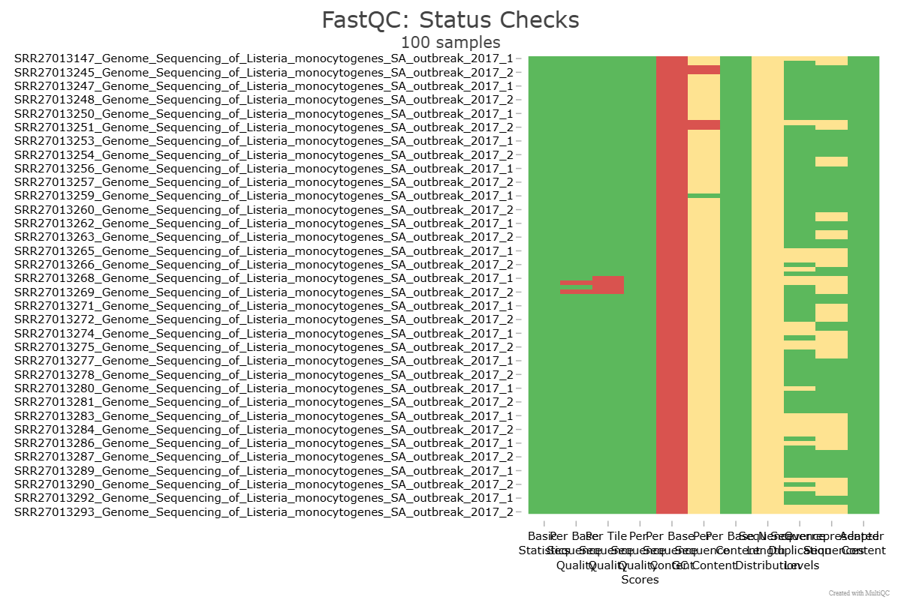
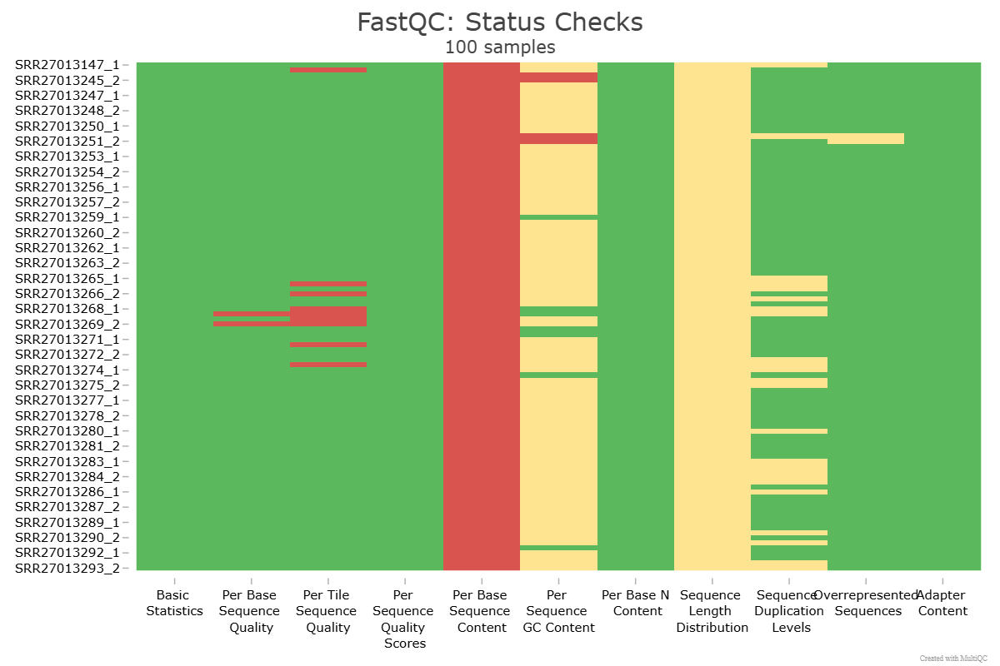
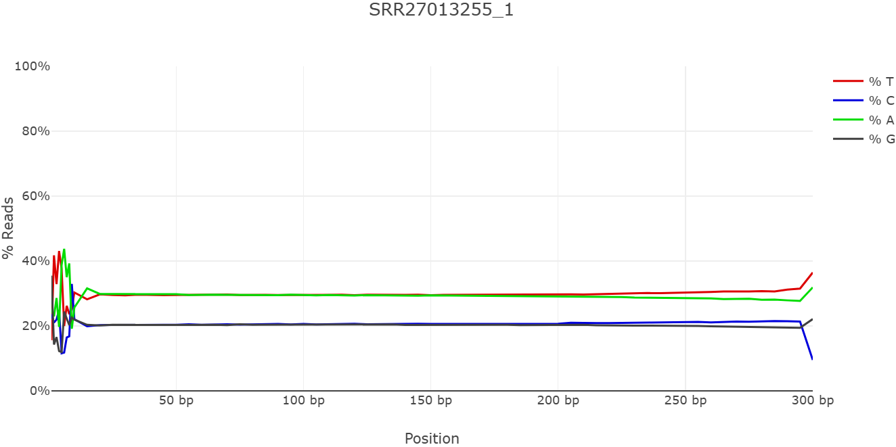
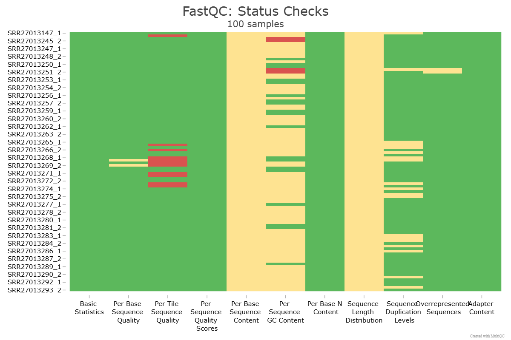
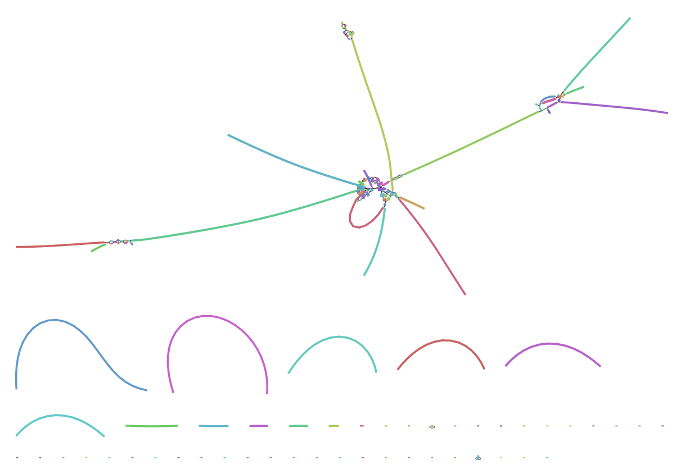

# Project Background 

## South African Polony
<p> 
In early 2017, South Africa faced a public health crisis that would become the world's largest recorded outbreak for a particular infection. Doctors at Chris Hani and Steve Biko academic hospitals noticed an alarming spike in neonatal infections, a clue that something sinister was spreading through the food supply.
</p>

<p>
By March 2018, the National Institute for Communicable Diseases (NICD) had reported 978 laboratory-confirmed cases, with 183 deaths a case fatality rate of 27%, which was devastatingly high for a foodborne illness. The majority of cases were concentrated in Gauteng (59%), Western Cape (12%), and KwaZulu-Natal (7%), with vulnerable groups like neonates, pregnant women, the elderly, and immunocompromised (especially HIV) patients were hit hardest.
</p>

<p>
Interviews with affected patients pointed to processed cold meats, particularly polony, as the likely culprit, but the exact source remained elusive. One common thing among all the interviewed patients is that they somehow traced back to polony bought from Enterprise Foods facility in Polokwane. This outbreak wasn’t just a national issue—products were exported to 15 African countries, raising fears of a regional spread. The stakes were high: how could scientists confirm the pathogen’s identity and uncover its resistance profile to guide treatment and prevent future outbreaks? The answer lies in the power of whole-genome sequencing (WGS), a tool that can unlock the genetic secrets of these deadly bacteria. As a team of bioinformatics students, you’re tasked with a critical mission: analyze WGS data from 100+ Bacterial isolates collected during the 2017–2018 South African outbreak.
</p>

## Goals
<p> Your goal is to: </p>

* Confirm the identity of the organism,
* Determine the antimicrobial resistance (AMR) profile of these pathogens.
* Detect if there might be a toxin that is accelerating the death rate
* Suggest antibiotics/treatment options that could be used managing the cases

# Methods
<p> This section outlines the steps performed in order to obtain, process, and analyze the given WGS data.
</p>

## Dataset 
* WGS data has been provided from 100 bacterial isolates.
* To obtain the dataset, this provided [script](https://raw.githubusercontent.com/HackBio-Internship/2025_project_collection/refs/heads/main/SA_Polony_100_download.sh) was executed and saved to a directory called `dataset`.
  * The script was split into 2 to avoid any issues that may arise due to memory or processes being killed automatically by the terminal.
  * Refer to `download.sh` and `download2.sh`

## NGS Data Pipeline
In this section, data processing of the WGS raw reads is performed in order to obtain a usable dataset that we can use to identify the bacteria, characterize it, and potentially treat it.

### Quality Control (QC)
We first perform QC in order to check the raw reads for problems such as low-quality bases, leftover adapter sequences, or weird patterns.

We use the program FastQC to create QC reports for our raw reads then MultiQC to aggregate the reports into one output.

> qc.sh
```
# Create output dir
mkdir qc_reports

# Run FastQC
fastqc ../polony_project/*.fastq.gz -o qc_reports/

# Aggregate reports to one
multiqc qc_reports
```

Due to there being many samples, the terminal killed the process. At this point, I'm not sure until where it finished, so I decided to do only 50 samples to avoid the processed being killed and because the project allowed to downsampling to this much. I then created a `samples.txt` file which contains 50 samples from the project using the following command:

```
ls dataset/*1.fastq.gz | head -n 50 | cut -d'/' -f2 | cut -d'_' -f1 | sort -u > samples.txt
```

With this, I re-run FastQC so it only does the ones in the `samples.txt` file. If it already exists, then no need to redo it.

> qc.sh
```
#!/bin/bash

SAMPLES="samples.txt"

while IFS= read -r sample; do
    # Find matching FASTQ files for this sample
    files=(dataset/${sample}*_1.fastq.gz dataset/${sample}*_2.fastq.gz)

    # Check if files exist
    if [[ ! -e "${files[0]}" ]]; then
        echo "No files found for $sample, skipping"
        continue
    fi

    # Check if FastQC has already been run
    html_files=(qc_reports/*${sample}*_fastqc.html)
    zip_files=(qc_reports/*${sample}*_fastqc.zip)
    if [[ -e "${html_files[0]}" && -e "${zip_files[0]}" 
&& -e "${html_files[1]}" && -e "${zip_files[1]}" ]]; then
        echo "Skipping $sample — already processed"
        continue
    fi

    # Run FastQC on both paired files
    echo "Running FastQC for $sample..."
    fastqc "${files[@]}" -o qc_reports/

done < "$SAMPLES"
```

I also made sure to delete any files that were not from the listed samples in `samples.txt` in case there were some leftover during the first run of my FastQC.

> del.sh
```
#!/bin/bash

SAMPLES="samples.txt"
TARGET_DIR="qc_reports"

# Loop over all files in the target directory
for file in "$TARGET_DIR"/*; do
    # Skip if it's a directory
    [ -d "$file" ] && continue

    keep=false

    # Check each sample in samples.txt
    while IFS= read -r sample; do
        if [[ "$(basename "$file")" == *"$sample"* ]]; then
            keep=true
            break
        fi
    done < "$SAMPLES"

    # Delete file if it doesn't match any sample
    if [ "$keep" = false ]; then
        echo "Deleting $file"
        rm -v "$file"
    fi
done
```

Then, I just run MultiQC separately on the `qc_reports` directory so that it will aggregate all the outputs. 

#### QC Results
The detailed results can be found [here](result/multiqc_report.html). The heatmap summary of the FastQC checks is displayed below:



From the heatmap, we can see that there are a lot of red and yellow areas across all samples. These warnings/failed tests are enumerated (out of the 100 samples) and described below.

|Test | Passed | Warning | Failed | Comments|
|-----|--------|---------|--------|---------|
|Mean Quality Score |98 |0| 2|Most samples have very good average quality, but 2 samples failed, meaning their overall quality is lower than expected. This is expected since this is still the raw data and should improve after trimming.|
|Per Base Sequence Content |0 |0| 100|Raw reads also often fail this test since they have not been trimmed yet i.e. they still have primers and adapters.|
|Per Sequence GC Content |1 |95| 4| Most were flagged with warnings, but may not necessarily indicate a problem.|
|Sequence Length Distribution |0 |100| 0| With trimming, read lengths will change so this makes sense for raw, untrimmed data.|
|Sequence Duplication Levels |76 |24|0| Filtering low quality reads may reduce some of this duplication, but since none failed, we know that they are not problems with PCR duplicates.|
|Overrepresented Sequences |58 |42| 0| There are 2 overrepresented sequences: NNNNNNNNNNNNNNNNNNNNNNNNNNNNNNNNNNN	 (40 samples, 56381 occurrences, 0.0794% of all reads) and AACTAAAACCGATCCATCATCAAAAACAGAAATTTGAACAGGTTGATAAT (2 samples, 1173 occurrences, 0.0017% of all reads). The first one is common in low-quality raw reads while th other one may be an adapter, primer, or just very common.|

Overall, this initial QC show issues that are typical of raw reads. The next section will focus on trimming, which should resolve most of these issues.


### Trimming
As shown on the MultiQC report from the previous section, out dataset contains a lot of issues typically observed in raw reads. In order to improve its quality, trimming is performed using FastP.

> trim.sh
```
#!/bin/bash

# Create output dir if it doesn’t exist
mkdir -p trimmed

SAMPLES="samples.txt"

while IFS= read -r sample; do
    # Define input files (with wildcards if needed)
    R1=$(ls dataset/${sample}*_1.fastq.gz 2>/dev/null)
    R2=$(ls dataset/${sample}*_2.fastq.gz 2>/dev/null)

    # Skip if no files found
    if [[ -z "$R1" || -z "$R2" ]]; then
        echo "Skipping $sample — input files not found"
        continue
    fi

    # Define outputs (no wildcards!)
    OUT1="trimmed/${sample}_1.fastq.gz"
    OUT2="trimmed/${sample}_2.fastq.gz"
    HTML="trimmed/${sample}_fastp.html"

    # Run fastp
    echo "Running fastp for $sample..."
    fastp \
        -i "$R1" \
        -I "$R2" \
        -o "$OUT1" \
        -O "$OUT2" \
        --html "$HTML"

done < "$SAMPLES"

```

#### Re-QC
After trimming, we check the quality of the trimmed reads by doing another QC step. Using a modified `qc.sh`, we perform another round of FastQC and MultiQC on the trimmed reads.

> re_qc.sh
```
#!/bin/bash
mkdir -p qc_reports_trimmed

SAMPLES="samples.txt"

while IFS= read -r sample; do
    # Find matching FASTQ files for this sample
    files=(trimmed/${sample}*_1.fastq.gz trimmed/${sample}*_2.fastq.gz)

    # Check if files exist
    if [[ ! -e "${files[0]}" ]]; then
        echo "No files found for $sample, skipping"
        continue
    fi

    # Check if FastQC has already been run
    html_files=(qc_reports_trimmed/*${sample}*_fastqc.html)
    zip_files=(qc_reports_trimmed/*${sample}*_fastqc.zip)
    if [[ -e "${html_files[0]}" && -e "${zip_files[0]}" 
&& -e "${html_files[1]}" && -e "${zip_files[1]}" ]]; then
        echo "Skipping $sample — already processed"
        continue
    fi

    # Run FastQC on both paired files
    echo "Running FastQC for $sample..."
    fastqc "${files[@]}" -o qc_reports_trimmed/

done < "$SAMPLES"

# Run MultiQC
multiqc qc_reports_trimmed/
```

#### Re-QC Results
Detailed results of the MultiQC after trimming are shown [here](result/multiqc_report_trimmed.html). Most warnings and failures were not removed by the default FastP. However, there is considerable change in the overrepresented sequences, totally removing the sequence of N bases. 



All of the samples still failed the "Per Base Sequence Content" check. In order to fix this, I looked at the plots for individual samples and noted that the problem lies on the first 15 bases and the last 5. This regions are almost always distorted across all samples and therefore causing the failures. A sample plot is shown below.



#### Trimming 2.0
To try and fix this problem, the trimming process is repeated but using more stringent parameters i.e. trimming the first 10 bases (more lenient than 15 bp) and the last 5 bases. This stricter trimming is performed in all samples, followed by another QC step.

> trim_front_back.sh
```
#!/bin/bash
set -euo pipefail

SAMPLES="samples.txt"
RAWDIR="dataset"          # directory with raw fastq.gz files
OUTDIR="trimmed_front_back"   # output directory
FASTQC_OUT="qc_trimmed_front_back" # FastQC output

mkdir -p "$OUTDIR" "$FASTQC_OUT"

while IFS= read -r sample || [[ -n "$sample" ]]; do
    # Find paired-end reads (adjust pattern if needed)
    R1=( "$RAWDIR"/${sample}*1.fastq.gz "$RAWDIR"/${sample}*_R1.fastq.gz )
    R2=( "$RAWDIR"/${sample}*2.fastq.gz "$RAWDIR"/${sample}*_R2.fastq.gz )

    if [[ ! -e "${R1[0]}" || ! -e "${R2[0]}" ]]; then
        echo "[WARN] Missing mates for $sample; skipping"
        continue
    fi
  
    IN1="${R1[0]}"
    IN2="${R2[0]}"
    OUT1="$OUTDIR/${sample}_1.trim.fastq.gz"
    OUT2="$OUTDIR/${sample}_2.trim.fastq.gz"
    HTML="$OUTDIR/${sample}_fastp.html"
    JSON="$OUTDIR/${sample}_fastp.json"

    echo "[INFO] Trimming $sample..."
    fastp \
        --detect_adapter_for_pe \
        --trim_front1 10 --trim_front2 10 \
        --trim_tail1 5  --trim_tail2 5 \
        -i "$IN1" -I "$IN2" \
        -o "$OUT1" -O "$OUT2" \
        --html "$HTML"

done < "$SAMPLES"

# Run FastQC to check results
fastqc "$OUTDIR"/*_1.trim.fastq.gz "$OUTDIR"/*_2.trim.fastq.gz -o "$FASTQC_OUT"

echo "[DONE] Check FastQC outputs in $FASTQC_OUT; optionally run MultiQC to summarize."

```

#### Re-QC of Trimming 2.0
Although not perfect, there is temendous improvement in the reads' quality after applying stricter trimming procedures. Detailed results can be found [here](result/multiqc_report_trimmed_front_back.html) and a summary is shown below. The issue with the "Per Base Sequence Content" failing on all samples has been resolved, though they are still with warning. This result is possibly due to the fact that only 10 bases were trimmed instead of 15 which was done to conserve the length of the reads. However, this quality, alongside little improvements on the other checks, would now be acceptable for the assembly stage. 



### De Novo Assembly
With the reads having acceptable quality, the next step is assembly of the bacterial genome which is a critical step in trying to identify it. To recreate the original genome for each smaple, the SPAdes genome assembler was used on the trimmed reads from the previous section. 

> assembly.sh
```
#!/bin/bash

# Make output dir
mkdir -p spades_assembly

SAMPLES="samples.txt"

while IFS= read -r sample; do
    spades.py \
        -1 "trimmed_front_back/${sample}_1.trim.fastq.gz" \
        -2 "trimmed_front_back/${sample}_2.trim.fastq.gz" \
        -o "spades_assembly/${sample}"
done < "$SAMPLES"
```

Assembly took about 3 hours for one sample so going through all 50 would take quite a while. As such, the following sections (Bandage, Blast, AMR/Toxin gene screening) were only performed on the first ten while we await the completion of assembly on all samples. 

#### Visualization with Bandage
To assess the quality of de novo assemblies, assembly graphs generated by SPAdes (assembly_graph.fastg) were visualized using Bandage which enables graphical exploration of contig connectivity and genome structure. Representative assemblies were opened in Bandage GUI to examine the overall assembly structure and to identify the largest contigs. This step was used to qualitatively evaluate assembly completeness and fragmentation but was not performed for all 50 isolates, as visualization was intended primarily for representative quality assessment.

The de novo assembly graph for one representative isolate (SRR27013147) was visualized using Bandage. It displayed multiple contigs without forming a complete circular chromosome, reflecting fragmentation typical of short-read assemblies. The largest contig was subsequently used for downstream BLAST analysis to confirm species identity.



## BLAST for Species Identification
To identify the source organism of each assembly, the largest contig from each sample’s contigs.fasta file was used for nucleotide BLAST (blastn) searches against the NCBI nucleotide database (nt). For each assembly, only the first 1,000 bp of the longest contig were queried to reduce query size while retaining sufficient sequence context for accurate identification. The top BLAST hit was recorded, and species name and e-value were extracted for summary across all samples.

> run_blast.sh
```
#!/usr/bin/env bash
set -euo pipefail

ASSEMBLY_DIR="spades_assembly"       
OUT_DIR="blast_results"
mkdir -p "$OUT_DIR"

# iterate over assembly directories
for dir in "$ASSEMBLY_DIR"/*; do
    [[ -d "$dir" ]] || continue
    sample=$(basename "$dir")
    contigs="$dir/contigs.fasta"
    SAMPLE_DIR="$OUT_DIR/${sample}"
    mkdir -p "$SAMPLE_DIR"
    query="$SAMPLE_DIR/query_first1k.fa"
    blastout="$SAMPLE_DIR/blast.tsv"

    # skip if contigs missing
    if [[ ! -f "$contigs" ]]; then
        echo "[SKIP] $sample: contigs.fasta not found"
        continue
    fi

    # skip if blast already done
    if [[ -f "$blastout" ]]; then
        echo "[SKIP] $sample: BLAST output already exists"
        continue
    fi

    echo "[INFO] Preparing query for $sample"

    
    # Take the first contig (everything from first '>' to next '>') and limit to 1000 bp
    awk 'BEGIN{RS=">"; ORS=""}
     NR>1 {
        split($0, lines, "\n");
        header = lines[1];
        seq = "";
        for(i=2; i<=length(lines); i++) seq = seq lines[i];
        if(length(seq)>1000) seq = substr(seq,1,1000);
        print ">" header "\n" seq "\n";
        exit
     }' "$contigs" > "$query"

    # quick sanity check: ensure query was written and non-empty
    if [[ ! -s "$query" ]]; then
        echo "[WARN] $sample: extracted query is empty - skipping BLAST"
        rm -f "$query"
        continue
    fi

    echo "[INFO] Running remote BLAST for $sample (this may take a while)"

    blastn -query "$query" -db nt -remote \
        -outfmt "6 qseqid ssciname evalue bitscore stitle" \
        -max_target_seqs 1 -out "$blastout" 2> "$SAMPLE_DIR/blast.log" || {
            echo "[ERROR] BLAST failed for $sample (see $SAMPLE_DIR/blast.log)"
            continue
            }

    echo "[DONE] $sample -> BLAST result: $blastout"

    # sleep 5 seconds to avoid hitting NCBI request limits
    sleep 5
done

echo "[ALL DONE] BLASTs placed in $OUT_DIR"
```

> blast_summarize.sh
```
#!/bin/bash

OUT_DIR="blast_results"
SUMMARY="blast_summary_species.tsv"

echo -e "Sample\tSpecies\tE-value" > "$SUMMARY"

# Loop through each sample folder
for sample_dir in "$OUT_DIR"/*/; do
    sample=$(basename "$sample_dir")  # get folder name
    file="$sample_dir/blast.tsv"

    if [[ -s "$file" ]]; then
        # Extract the first hit (collapse isolates)
        evalue=$(awk 'NR==1{print $3}' "$file")
        species=$(awk 'NR==1{for(i=5;i<=NF;i++) printf "%s ", $i; print ""}' "$file" | awk '{print $1, $2}')
        
        # Default if empty
        [[ -z "$species" ]] && species="No_hit"
        [[ -z "$evalue" ]] && evalue="NA"

        echo -e "${sample}\t${species}\t${evalue}" >> "$SUMMARY"
    else
        echo -e "${sample}\tNo_hit\tNA" >> "$SUMMARY"
    fi
done

echo "[DONE] Summary written to $SUMMARY"
```

> blast_freq.sh
```
#!/bin/bash

SUMMARY="blast_summary_species.tsv"
FREQ_FILE="blast_species_frequency.tsv"

# Count total number of samples
TOTAL=$(awk 'NR>1{count++} END{print count}' "$SUMMARY")

echo -e "Species\tCount\tPercentage" > "$FREQ_FILE"

# Tally species counts using all fields from column 2 onward
awk -v total="$TOTAL" 'NR>1 {
    species = $2
    for(i=3;i<=NF;i++) species = species " " $i
    species_count[species]++
}
END {
    for (sp in species_count) {
        pct = (species_count[sp]/total)*100
        printf "%s\t%d\t%.2f%%\n", sp, species_count[sp], pct
    }
}' "$SUMMARY" >> "$FREQ_FILE"

echo "[DONE] Frequency summary written to $FREQ_FILE"
```

## AMR/Toxin Gene Screening
Antimicrobial resistance (AMR) and toxin-associated genes were screened using ABRicate. ABRicate allows rapid detection of known resistance and virulence determinants by aligning assembled contigs against curated gene databases. For each genome assembly, ABRicate was run against both the ResFinder database (for AMR genes) and the VFDB database (for virulence and toxin-associated genes). 

> run_abricate.sh
```
#!/bin/bash

ASSEMBLY_DIR="spades_assembly"
OUT_DIR="abricate_results"
mkdir -p "$OUT_DIR"

DBS=("ncbi" "vfdb")   # ncbi = AMR genes, vfdb = virulence/toxins

for sample in $(ls "$ASSEMBLY_DIR"); do
    contigs="$ASSEMBLY_DIR/$sample/contigs.fasta"

    # Skip if contigs missing
    if [[ ! -f "$contigs" ]]; then
        echo "Skipping $sample: contigs.fasta not found"
        continue
    fi

    for db in "${DBS[@]}"; do
        outfile="$OUT_DIR/${sample}_${db}.tab"

        # Skip if abricate already run
        if [[ -f "$outfile" ]]; then
            echo "Skipping $sample ($db): already processed"
            continue
        fi

        # Run abricate
        abricate --db "$db" "$contigs" > "$outfile"
        echo "Finished abricate for $sample ($db)"
    done
done
```

Results were exported in tabular format, and custom scripts were used to summarize the presence and frequency of identified genes across all samples. Genes were considered present if they exceeded ABRicate’s default coverage and identity thresholds.

> abricate_summary.sh
```
#!/usr/bin/env bash

# Directory containing abricate results
RESULTS_DIR="abricate_results"

# Output files
AMR_OUT="amr_summary.tsv"
VIR_OUT="vir_summary.tsv"

# Temporary files
AMR_TMP="amr_gene_sample.tsv"
VIR_TMP="vir_gene_sample.tsv"

# --- AMR genes ---
echo "Summarizing AMR genes..."
for f in "$RESULTS_DIR"/*_ncbi.tab; do
    sample=$(basename "$f" _ncbi.tab)
    # get gene names (column 6), skip header
    awk 'NR>1 {print $6}' "$f" | sort -u | \
    awk -v s="$sample" '{print $1"\t"s}'
done | sort -u > "$AMR_TMP"

awk '{genes[$1]++; samples[$2]++}
     END{
         total=length(samples);
         for (g in genes)
             printf "%s\t%d\t%.2f%%\n", g, genes[g], (genes[g]/total*100)
     }' "$AMR_TMP" | sort -k2,2nr > "$AMR_OUT"


# --- Virulence genes ---
echo "Summarizing virulence genes..."
for f in "$RESULTS_DIR"/*_vfdb.tab; do
    sample=$(basename "$f" _vfdb.tab)
    awk 'NR>1 {print $6}' "$f" | sort -u | \
    awk -v s="$sample" '{print $1"\t"s}'
done | sort -u > "$VIR_TMP"

awk '{genes[$1]++; samples[$2]++}
     END{
         total=length(samples);
         for (g in genes)
             printf "%s\t%d\t%.2f%%\n", g, genes[g], (genes[g]/total*100)
     }' "$VIR_TMP" | sort -k2,2nr > "$VIR_OUT"


# Cleanup
rm "$AMR_TMP" "$VIR_TMP"

echo "Done! Results saved to $AMR_OUT and $VIR_OUT"
```

# Results

## Identifying the Organism
Preliminary species identification was performed using BLAST searches of the longest contig from each sample. To accommodate BLAST query limits and reduce processing time, sequences were restricted to a maximum length of 1,000 bp. Of the 50 samples in the dataset, 22 have been processed to date. (Still waiting on other 28 to finish running)

Among these, 21/22 (95.5%) were identified as Listeria monocytogenes, with all matches returning an e-value of 0.0, indicating highly confident assignments. Notably, one sample (SRR27013245) was classified as Brucella anthropi. This unexpected result warrants further attention to determine whether it reflects contamination, mislabeling, or the presence of a genuine secondary species in the datase

## AMR Genes
All isolates carried fosX and lmo0919_fam, indicating ubiquitous resistance to fosfomycin. The blaOCH-5 gene was rare, detected in only one isolate, suggesting minimal beta-lactamase–mediated resistance in this dataset.
| AMR Gene     | Prevalence (n/% of isolates) | Resistance Implications                                                       |
| ------------ | ---------------------------- | ----------------------------------------------------------------------------- |
| fosX         | 23 / 100%                    | Confers intrinsic resistance to fosfomycin; observed in all isolates.         |
| lmo0919\_fam | 23 / 100%                    | Associated with fosfomycin resistance; ubiquitous in the dataset.             |
| blaOCH-5     | 1 / 4.35%                    | Beta-lactamase gene; rare occurrence suggests minimal beta-lactam resistance. |


## Toxin Genes
Most isolates carried a core set of virulence genes, including actA, bsh, clpC/E/P, hly, and several adhesion factors (lap, lapB, fbpA). A subset of genes (e.g., inlB, lls operon genes) were present in fewer isolates, suggesting variable virulence potential.

| Number of Samples | % of Samples | Genes                                                                                                           |
| ----------------- | ------------ | --------------------------------------------------------------------------------------------------------------- |
| 23                | 100.00%      | actA, bsh, clpC, clpE, clpP, fbpA, hly, lap, lapB, lntA, lpeA, lplA1, lspA, mpl, oatA, pdgA, fosX, lmo0919\_fam |
| 22                | 95.65%       | iap/cwhA, inlK, prfA                                                                                            |
| 21                | 91.30%       | inlA, inlC                                                                                                      |
| 18                | 78.26%       | inlB                                                                                                            |
| 17                | 73.91%       | gtcA                                                                                                            |
| 16                | 69.57%       | llsA                                                                                                            |
| 11                | 47.83%       | inlF, llsG, llsX                                                                                                |
| 10                | 43.48%       | llsH                                                                                                            |
| 5                 | 21.74%       | llsB, llsY                                                                                                      |
| 3                 | 13.04%       | llsD                                                                                                            |
| 2                 | 8.70%        | llsP                                                                                                            |
| 1                 | 4.35%        | acpXL, cgs, fabZ, htrB, kdsA, kdsB, pgm, blaOCH-5                                                               |


# Public Health Discussion
The antimicrobial resistance (AMR) profiles of these isolates provide important insight into potential treatment challenges and inform evidence-based therapeutic decisions.

## AMR Profiles
All isolates carried fosX and lmo0919_fam, consistent with intrinsic fosfomycin resistance. Beta-lactam resistance was rare, with only 1 isolate harboring blaOCH-5. Overall, these data suggest a relatively narrow AMR spectrum among the isolates, with fosfomycin resistance being ubiquitous and other resistance determinants being sporadic. 

These findings have direct implications for clinical management and public health strategies. The ubiquity of fosfomycin resistance suggests that this antibiotic would likely be ineffective, whereas the low prevalence of beta-lactamase genes indicates that beta-lactam antibiotics may remain largely effective. Continuous surveillance of AMR determinants is essential to detect emerging resistance patterns and guide empirical therapy, particularly in outbreak or high-risk settings.

## Antibiotics
Given the universal resistance to fosfomycin, alternative agents should be considered for treatment. The low prevalence of beta-lactamase genes suggests that ampicillin and other beta-lactams remain viable options for most isolates. Additionally, macrolides or tetracyclines could be considered where susceptibility testing confirms efficacy, though empirical use should be guided by local resistance patterns and clinical context. For isolates carrying rare resistance determinants, targeted therapy based on genotypic or phenotypic susceptibility testing is recommended to ensure effective treatment and minimize the risk of selecting for further resistance.

# Limitations and Future Directions

While the BLAST-based species identification reliably classified the majority of isolates as Listeria monocytogenes (e-value 0.0), using only the longest contig and limiting BLAST searches to 1,000 bp may constrain the resolution of species detection. This approach was chosen to balance processing time with accuracy, as the high-confidence e-values suggest correct classification. Future analyses could employ consensus-based methods using multiple contigs, additional marker genes, or alternative databases to further validate species identification and detect potential co-infections or mixed samples.

Similarly, the AMR gene analysis relies on assembled contigs and sequence-based detection; while these results provide a strong preliminary overview, sequencing or assembly errors could influence the identification of resistance determinants. Incorporating phenotypic validation (e.g., susceptibility testing) and expanding the dataset would strengthen the findings and confirm the functional relevance of the detected genes. Overall, these steps would improve confidence in both species identification and AMR profiling while allowing for more robust interpretation in a public health context.

# Professional Profile
* Github: https://github.com/calicac001
* LinkedIn: www.linkedin.com/in/chloe-nichole-calica-3abb18262